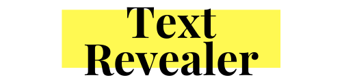

Reveal deeper information about highlighted text on a web page. When text is selected, a popover displays useful details about the text such as:

- Wikipedia entries
- Dictionary definition
- ...and more to come.

[https://jamigibbs.github.io/text-revealer-js/](https://jamigibbs.github.io/text-revealer-js/)

### Features TODO

- [ ] Twitter search API
- [ ] Chrome Extension

### Preview

[](https://jamigibbs.github.io/text-revealer-js/)

### Getting Started

#### Local Development

Install dependencies:

`npm install`

Generate compiled script and style:

`npm run build`

#### Install on a single website

Load script and stylesheet:

```html
  <link href="text-revealer.css" rel="stylesheet">
  <script src="text-revealer.js"></script>
```

Assign options and initialize the script:

```js
  const myTextRevealer = new TextRevealer({ 
    wikipedia: true,
    merriamWebsterDictionary: false,
    delay: 500,
    scrollIntoView: true
  });

  myTextRevealer.init();
```

#### Install across all website

The script is most helpful while using it as you're surfing the web. There are several different ways to inject the script so that it loads on all websites. Here's an example with the [Witchcraft](https://luciopaiva.com/witchcraft/) Chrome extension:

**Usage with Witchcraft**

[Witchcraft](https://luciopaiva.com/witchcraft/) is a Google Chrome extension for loading custom Javascript and CSS directly from a folder in your file system and injecting them into pages.

You can use Witchcraft to load this script across all sites while you're browsing the web. To do that, install the Witchcraft extension, follow their [installation instructions](https://luciopaiva.com/witchcraft/how-to-install.html), and rename the following file:

`text-revealer.css` to `_global.css`

Then create a file called `_global.js` and add to it the following (where you can customize the settings however you'd like):

```js
  // @include text-revealer.min.js

  const myTextRevealer = new TextRevealer({ 
    wikipedia: true,
    merriamWebsterDictionary: false,
    delay: 500,
    scrollIntoView: true
  });

  myTextRevealer.init();
```

### Options

```js
  const myTextRevealer = new TextRevealer({ 
    delay: 500, // milliseconds delay before the popover displays.
    scrollIntoView: true, // positions the popover into view when set to true.
    approvedTags: ['div','p','span','h1','h2','h3','h4','h5','h6','header','li','pre','b','strong'] // array of html tags.
    disabledTags: ['input', 'textarea', 'code', 'a'] // array of html tags.
    wikipedia: false, // Set to true for fetching wiki info.
    merriamWebsterDictionary: false,  // Provide an API key for fetching dictionary info; https://dictionaryapi.com/
    skin: 'light', // Popover skin; 'light' or 'dark'.
    maxTextCount: 3 // When text is highlighted, the max number of words allowed.
  });
```
